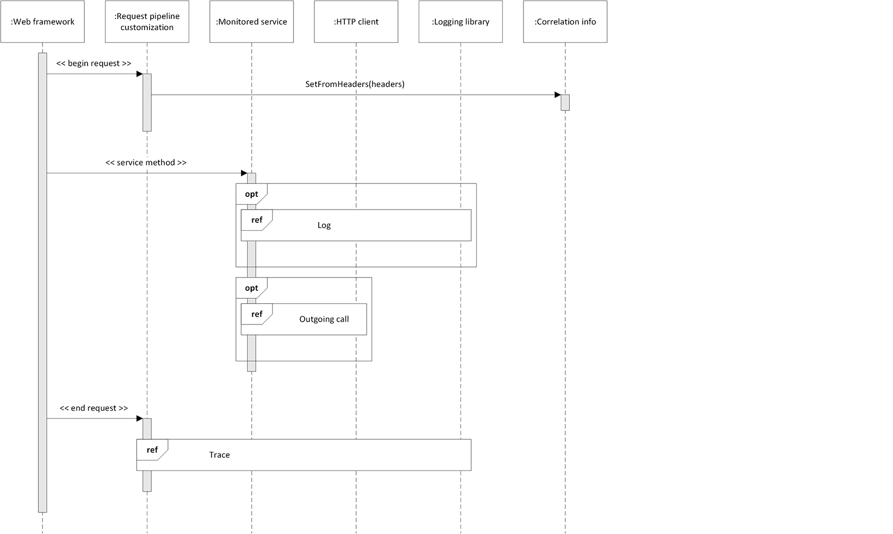
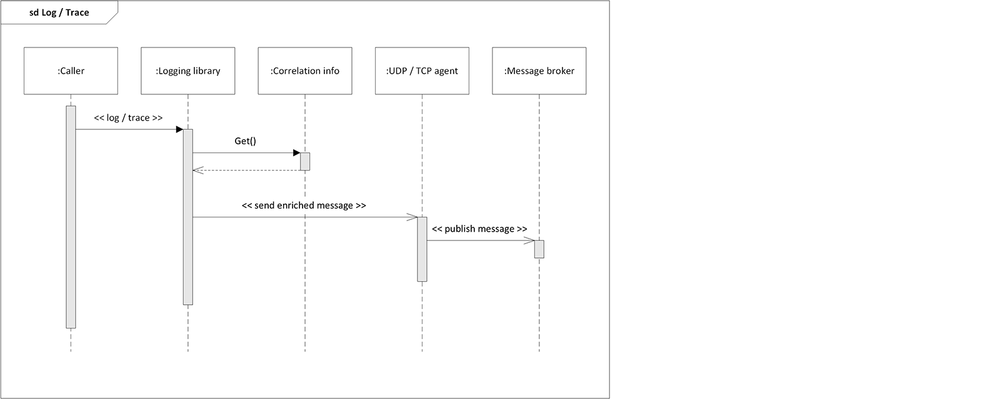
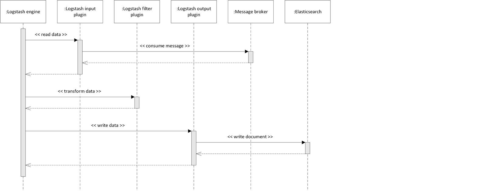

# Distributed logging and tracing kata solution

This solution uses few custom-built components and limits the amount of different technologies reducing the time-to-market but allowing for extensibility by means of iterative and incremental improvements.


## Overview

A service belonging to a distributed system is implemented by writing custom code that is called by a web framework.

It is possible to correlate application logs and traces by means of correlation information stored in HTTP headers:
 - the request pipeline customization either generates new info or retrieves info from the request headers (if the service was called by another one) then tracing the received call by means of the logging library
 - the monitored service logs by means of the logging library
 - HTTP client calls forward the correlation info (adding headers to the request) and trace outgoing calls by means of the logging library
 - the logging library uses the correlation info to enrich messages

By using a logging library and logging to an UDP or, if messages should not be lost, TCP agent, the solution is quickly adaptable to many programming languages with less custom code to be maintained.

Agents do not need to be implemented in multilpe languages and are deployed locally to avoid network-related issues. A message broker is used to allow for greater scalability and decouple applications from the log and trace management system: messages are forwarded by agents to the broker.

Logstash will be consuming messages from the broker via an input plugin, then transforming the messages in a format suitable for Elasticsearch via a filter plugin and finally writing to Elasticsearch via an output plugin.

Kibana will be used to query Elasticsearch and visualize data:
 - to visualize related items, like all service calls related to a user request, it is possible to use the [Graph plugin](http://www.elastic.co/products/x-pack/graph) or the [Network plugin](http://dlumbrer.github.io/kbn_network/) or to develop custom plugins to cover specific use cases
 - dashboards can be created to show, filter, query, cross, analyse log and trace information
 - Prelert machine learning technology has been [integrated into Elasticsearch](https://www.elastic.co/blog/introducing-machine-learning-for-the-elastic-stack) allowing anomaly detection and prediction


## Diagrams

The [images](images) folder contains the following images in **PNG** and **SVG** format.

### Component diagram


### Service sequence diagrams





### Logstash sequence diagram


### Kibana sequence diagram


## Evolutions

Tools used for software troubleshooting have a similar architecture:
 - reporting library (to instrument applications and/or servers)
 - data collector
 - data store
 - APIs to retrieve data
 - UI to retrieve data from the API and visualize it

Here follow some ideas on how to evolve the presented solution:
1. Syslog or Fluentd could be used to unify logging collectors for applications and systems
2. tracing could adopt a sampling strategy to avoid causing performance issues
3. data analysis and prediction can be improved using a post-processing and aggregation data pipeline based on Spark
4. custom Kibana plugins or a custom UI can be developed to be tailored to requirements and ease UX
5. we could unify metrics, trace and log management when either Elasticsearch support for time series data will be better or Grafana alerting will support Elasticsearch as a data source


## Proof of concept
The PoC demonstrates that it is possible to create application logs and traces and view them in Kibana using it to graph and analyse them.

The agent is Logstash (with the UDP input plugin) and the broker RabbitMQ.
Machine learning features have been left out of scope: failure prediction has not been tested.

The `src` folder contains a basic C# implementation of the solution developed using Visual Studio 2017 and the .NET Framework 4.7:
 - a self hosted ASP.NET Web Api with the resources A, B (that calls C), C (that calls www.google.com)
 - an OWIN middleware to customize the request pipeline
 - a custom HttpMessageHandler to handle outgoing calls
 - logging extensions and NLog with the Network target sending via UDP

To test the C# application against a virtual machine please follow the instructions below:
1. Install the [Microsoft .NET Framework 4.7 Developer Pack](http://www.microsoft.com/en-us/download/details.aspx?id=55168)
2. Install [VirtualBox and its Extension Pack](http://www.virtualbox.org/wiki/Downloads)
3. Install [Vagrant](https://www.vagrantup.com/downloads.html) (Vagrant 1.9.4 needs to be manually [patched](http://github.com/mitchellh/vagrant/issues/8520))
2. Download the [Vagrantfile](tools/Vagrantfile) provided with this repo
3. Execute the command `vagrant up`
4. Connect via SSH to localhost on port 2200 with username `vagrant` and password `vagrant`
5. Execute the following command from the Linux shell:
   ```shell
   git clone http://github.com/luigiberrettini/distributed-logging-and-tracing-kata ~/dlt && ~/dlt/tools/run.sh
   ```
6. Execute the following command from the Windows shell:
   ```shell
   git clone http://github.com/luigiberrettini/distributed-logging-and-tracing-kata .\dlt && .\dlt\tools\run.bat
   ```
7. Open your browser
8. Go to http://localhost:9000/resourceA then to http://localhost:9000/resourceB
9. Check the Windows shell for console logs
10. Go to RabbitMQ management opening URL http://localhost:15672 to check if messages have been handled
11. Check if a `dlt-*` index has been created on Elasticsearch opening URL http://localhost:9200/_cat/indices?v
12. Go to Kibana opening URL http://localhost:5601 (it might take up to 10 minutes to the containerized Kibana to be ready to accept connections)
13. Configure the `dlt-*` index pattern with `@timestamp` as time field
14. Click on **Discover** to see logs and traces
15. To display the map of calls click on **Visualize** and create a Network visualization on the `dlt-*` index with a `Node` bucket on the field `parentCallId.keyword`, a `Node` sub-bucket on the field `callId.keyword` and a `Node Color` sub-bucket on the field `requestId.keyword` (it is also possible to increase bucket size and filter by request id or change options to display directional edges/connections between nodes)