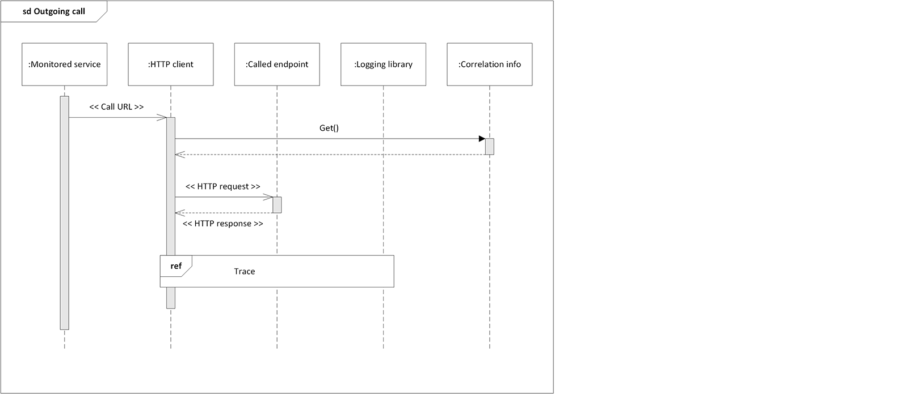

# Distributed logging and tracing kata solution

This solution uses few custom-built components and limits the amount of different technologies reducing the time-to-market but allowing for extensibility by means of iterative and incremental improvements.

## Overview

A service belonging to a distributed system is implemented by using custom code and a web framework.

It is possible to correlate application logs and traces by means of correlation info stored in HTTP headers:
 - retrieve info from headers if called by other service or generate new info
 - logging library uses correlation info
 - HTTP client forwards correlation info to called services
 - HTTP client uses the logging library for logging and tracing purposes

Using a logging library and the related logging plugins, the solution is quickly adaptable to many programming languages (less custom code) and we can log also to a different target with no effort, should we need to do so.

Depending on the available logging plugins, messages can be published to RabbitMQ or Kafka.
A message broker is used to allow for greater scalability and decouple applications from the log and trace management system.

Logstash will be consuming messages from the broker via an input plugin, then transforming the messages in a format suitable for Elasticsearch via a filter plugin and finally writing to Elasticsearch via an output plugin.

Kibana will be used to query Elasticsearch and visualize data:
 - the Graph plugin allows to visualize related items like all service calls related to a user request
 - dashboards can be created to show, filter, query, cross, analyse log and trace information
 - Prelert machine learning technology has been [integrated into Elasticsearch](https://www.elastic.co/blog/introducing-machine-learning-for-the-elastic-stack) allowing anomaly detection and prediction

## Diagrams

### Component diagram

### Service sequence diagrams

### Logstash sequence diagram

### Kibana sequence diagram

## Evolutions

Tools used for software troubleshooting have a similar architecture:
 - reporting library (to instrument applications and/or servers)
 - data collector
 - data store
 - APIs to retrieve data
 - UI to retrieve data from the API and visualize it

Here follow some ideas on how to evolve the presented solution:
1. a local UDP/TCP agent could be used to simplify communication and reduce latency
2. Syslog or Fluentd could be used to unify logging collectors for applications and systems
3. to reduce performance impacts tracing could adopt a sampling strategy
4. data analysis and prediction can be improved using Spark jobs to aggregate data for use in the UI
5. a custom UI can be developed to be tailored to requirements and easier to use
6. we could unify metrics, trace and log management when Elasticsearch will have better time series support or Grafana alerting support for Elasticsearch